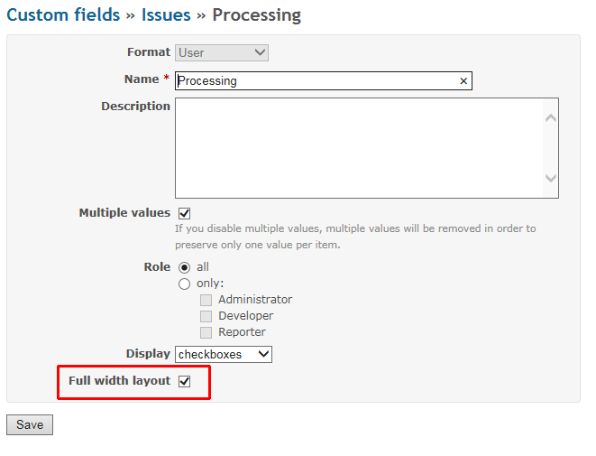
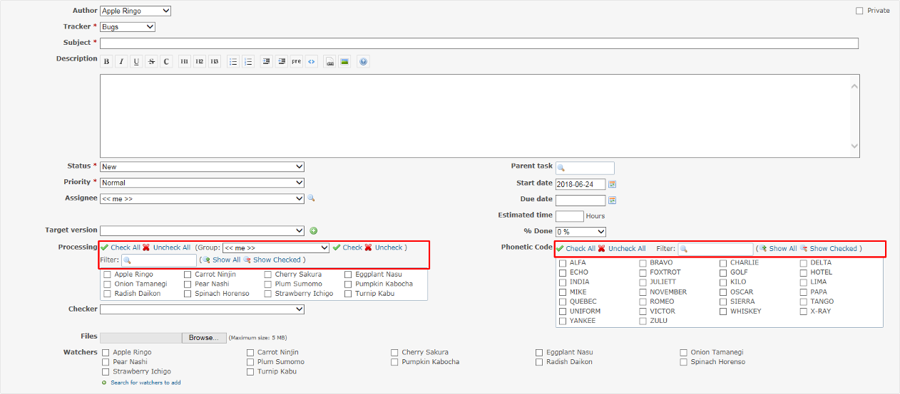
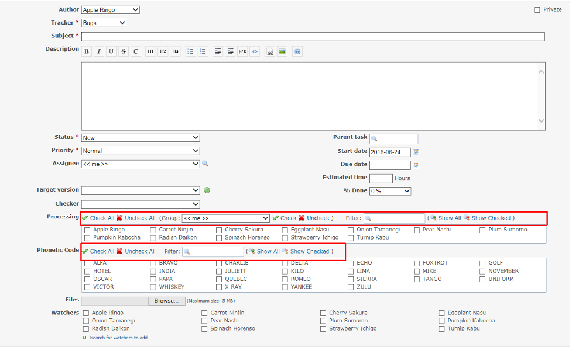
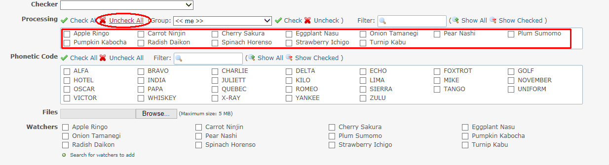
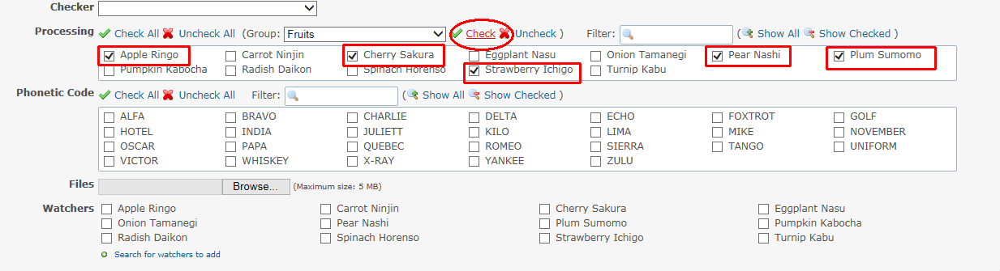
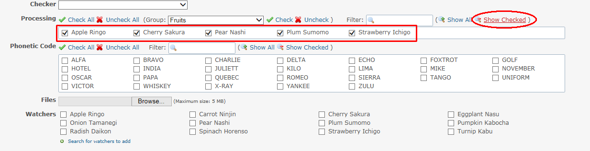

# Custom Field Checkboxes Utility plugin
[日本語](README_Ja.md)

This plugin is to improve the usability for Custom Fields of "User" and "List" Format.  
This plugin is enabled on Custom Fields that "Multiple values" and "checkboxes" Display are set.

This plugin was created to improve the usability of multi assignees functionality with custom_users_as_assignees plugin.
https://github.com/preciousplum/custom_users_as_assignees

## Installation

1. To install the plugin

    `git clone` to `plugins/customfield_checkbox_utility` on your Redmine path.

        $ cd {RAILS_ROOT}/plugins
        $ git clone https://github.com/preciousplum/customfield_checkbox_utility

2. Restart Redmine.

    Now you should be able to see the plugin in **Administration > Plugins**.  
    *) Database Migration is **not** required.

## Compatibility
This plugin version is compatible with Redmine 3.4.* in principle.  
However, this plugin has been tested on Redmine 3.4.5 only currently.

## Screen Image
"Full width layout" setting is enabled on Custom Fields setting of "User" and "List" Format.
  

The normal screen image that "Full width layout" setting is NOT checked.  
  

The screen image that "Full width layout" setting is checked.  
  

It is able to check all checkboxes at once by clicking "Check All".  
  

It is also able to uncheck all of checkboxes at once by clicking "Uncheck All".  
  

It is able to check and uncheck all members in groups at once at "User" format Custom Fields. 
  

It is able to filter checkboxes by inputting "Filter".  
  

It is able to filter checked checkboxes.  
  
